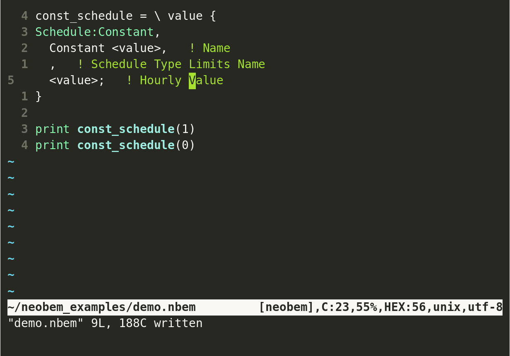

# Neobem

Neobem is a preprocessor programming language primarily targeted for the
idf input files for [EnergyPlus](https://energyplus.net). It also
supports the Building Description Language used for
[DOE-2](https://www.doe2.com/).

You can download the entire user manual in PDF form
[here](https://neobem.io/neobem.pdf) or view online at
[neobem.io](https://neobem.io).

Quick links:

-   [Intro](#introduction)
-   [Getting Started](#getting-started)
-   [Support](#support)
-   [Contributing](#contributing)
-   [Building from Source](#building-from-source)

# Introduction

While creating your building energy simulation input files, have you
ever wanted to:

-   Use variables?
-   Break out sections into custom templates?
-   Use arithmetic?
-   Build objects directly from Excel or JSON data?
-   Loop over lists?
-   Easily incorporate work from others?
-   Do all this without setting up a full Python, R, or Ruby working
    environment?

If so, Neobem is what you have always wanted.

At its core, Neobem is a command line application that follows the Unix
principle of doing one thing and doing it well. That thing is compiling
an expressive programming syntax into building energy simulation input.

It is a [Unix filter
program](https://en.wikipedia.org/wiki/Filter_(software)), taking input
via standard input or a file and writing the results to standard output.
It is designed to play one role in larger processing pipelines.

I hope you find it as useful as I do.

# Getting Started

## Installation

### Quick Instructions

1.  Download program file from
    [GitHub](https://github.com/mitchpaulus/neobem/releases).
2.  Add directory location containing program file to `PATH` environment
    variable or symlink the executable `nbem` to a location in `PATH`.
3.  Execute `nbem` in shell or command interpreter.

See below for additional details on these steps.

### Download Program

The latest release of Neobem is on GitHub, at
<https://github.com/mitchpaulus/neobem/releases>. There you will see
zips containing a compiled executable for various operating systems and
CPU architectures.

1.  linux-arm64.zip
2.  linux-arm.zip
3.  linux-musl-x64.zip
4.  linux-x64.zip
5.  osx-x64.zip
6.  win-arm64.zip
7.  win-arm.zip
8.  win-x64.zip
9.  win-x86.zip

Download the zip file that matches your operating system and
architecture.[^1] For most people, this will be `win-x64`, `linux-x64`,
or `osx-x64`.

The zip file will contain a single self contained executable. Extract
that file from the zip file to a location that you will want the program
to live. It doesn’t really matter where you put it, but recommended
places would be:

-   `C:\Program Files\neobem\neobem.exe` on Windows
-   `/usr/local/bin/nbem` or `~/.local/bin/nbem` on Linux

Neobem is a console or command line application. It is meant to be run
from a shell environment, that could be anything like[^2]:

-   `cmd.exe` or PowerShell on Windows
-   `bash`, `zsh`, or `fish` running in any terminal emulator, such as:
    -   Windows Terminal
    -   Terminal.app
    -   iTerm2
    -   Gnome Terminal
    -   Alacritty
    -   Konsole
    -   Terminator

### Add Program Location to PATH Variable

Once the program files are installed in your preferred location, you
will want to add the folder to the `PATH` environment variable (if the
location you put it in isn’t already there). Another option is to
symlink the executable to a location that is already in the `PATH`
variable. Here’s a
[link](https://www.howtogeek.com/howto/16226/complete-guide-to-symbolic-links-symlinks-on-windows-or-linux/)
for creating symlinks in Windows, and another
[link](https://www.howtogeek.com/287014/how-to-create-and-use-symbolic-links-aka-symlinks-on-linux/)
for creating symlinks in Linux.

#### Windows

On Windows, you can get to the dialog box to change the `PATH` variable
by doing a search for ‘Edit System Environment Variables’. There are
several biog posts on the Internet that can guide you through this with
screenshots, here are a curated few:

-   <https://www.architectryan.com/2018/03/17/add-to-the-path-on-windows-10/>
-   <https://www.howtogeek.com/118594/how-to-edit-your-system-path-for-easy-command-line-access/>

Here’s a post on Superuser answering the question, [“What are PATH and
other environment variables, and how can I set or use
them?”](https://superuser.com/questions/284342/what-are-path-and-other-environment-variables-and-how-can-i-set-or-use-them)

#### Linux/OSX

Setting the `PATH` variable is most often done in the initialization of
the particular shell that you are using. The default shell on many
systems is `bash`. To add a location to the `PATH` every time bash is
invoked, you follow the steps
[here](https://unix.stackexchange.com/questions/26047/how-to-correctly-add-a-path-to-path).
You add the location to the existing `PATH` variable in the
`.bash_profile` or `.bashrc` initialization file, making sure it is
exported.

If you are using a different shell, you already likely know how to add
locations to the PATH, but for example the syntax for
[fish](https://fishshell.com/) (the interactive shell I personally use),
the syntax looks like:

``` fish
set -gxp PATH "/path/to/directory"
```

## Creating Neobem Input Files

The input files are simple text files - you can use any editor of choice
to create them. Here’s a list of popular text editors that you might
want to try. If you’ve never heard of a “text editor”, I’d begin with
Visual Studio Code, Sublime Text, or Atom.

**Cross-Platform:**

1.  [Visual Studio Code](https://code.visualstudio.com/)
2.  [Sublime Text](https://www.sublimetext.com/)
3.  [Atom](https://atom.io/)
4.  [Vim](https://www.vim.org/)
5.  [Neovim](https://neovim.io/)
6.  [Kate](https://kate-editor.org/)
7.  [Emacs](https://www.gnu.org/software/emacs/)

**Windows:**

1.  [Notepad++](https://notepad-plus-plus.org/)
2.  Notepad - yes, that Notepad built into Windows

**Linux:**

1.  [gEdit](https://wiki.gnome.org/Apps/Gedit)
2.  [Nano](https://www.nano-editor.org/)

## Execute the Program

On Windows, the program is called `nbem.exe`. On Linux and OSX, it is
just `nbem` with no extension.

From the shell, you can test that things are working by running the
command with the help argument like:

``` console
mp@mp-computer:~$ nbem -h
```

on Windows:

``` console
C:\Users\mpaulus> nbem.exe -h
```

If things are working correctly, you should see help text like:

``` console
mp@mp-computer:~$ nbem -h
USAGE: nbem [options..] [input file]
Compile Neobem file to EnergyPlus or DOE-2 input files.

With no [input file], input is read from file named 'in.nbem' in the
current directory. If the input file is '-', input is read from standard
input rather than from a file.

OPTIONS:

    --doe2              Parse input file in DOE-2 Building Description Language format
-h, --help              Show this help and exit
-f, --fmt               Format file instead of compiling
-o, --output <filename> Output file name. Output is printed to standard output by default.
    --tokens            Print lexed tokens for debugging
    --tree              Print parse tree in Lisp format for debugging
-v, --version           Print version number and exit
```

In general, you will call the execute the program `nbem`, passing in
your Neobem input file as an argument.

To compile a Neobem file to an idf file, execute a command like

``` console
mp@mp-computer:~$ nbem in.nbem
```

where `in.nbem` is the relative path to the file you want to compile. In
the example above, this would be the `in.nbem` file in my home directory
(‘`~`’). By default, the compiled output is printed to standard output,
which you will see on the screen. To put the output into a file, either
specify the file path as a option, or redirect the output in the shell.

**Using Option:**

``` console
mp@mp-computer:~$ nbem -o output.idf in.nbem
```

**Using Redirection:**

``` console
mp@mp-computer:~$ nbem in.nbem > output.idf
```

Please see this [screencast
link](https://asciinema.org/a/392845?size=big) that shows an example
workflow from start to finish. This particular workflow example used
`bash` as the shell and the files were edited with Neovim.

<figure>

<figcaption aria-hidden="true">Sample screenshot from demo at: <a
href="https://asciinema.org/a/392845?size=big">asciinema.org</a>.</figcaption>
</figure>

# Support

If you believe you have come across a bug, please open a new GitHub
issue. Please attempt to produce a [“minimum reproducible example
(MRE)”](https://en.wikipedia.org/wiki/Minimal_reproducible_example) file
that reproduces the problem. If the code snippet is small enough,
include directly in the issue, otherwise attach the associated file.

You can also attempt to get support on [Unmet
Hours](https://unmethours.com/questions/), a site similar in spirit to
[Stack Overflow](https://stackoverflow.com/), but for building energy
modelers. Make sure to tag the question with `neobem` as I have an email
alert set up for those questions.

# Contributing

Feedback and contributions are welcomed. Small contributions can made
directly in Pull Requests. If you’d like to propose a more significant
or more fundamental change, I ask that it first be discussed to prevent
wasted effort. Please use the
[“Discussions”](https://github.com/mitchpaulus/neobem/discussions)
within the GitHub repository, likely in the “General” or “Ideas”
category.

If the change adds functionality, corresponding unit tests would be
expected. Tests are located in the `test` project/directory.

For coding style conventions, you can follow the conventions laid out by
Microsoft
([link](https://docs.microsoft.com/en-us/dotnet/csharp/fundamentals/coding-style/coding-conventions)).

# Building from Source

Building from source requires the following dependencies:

1.  A .NET environment. Typically installed with [Visual
    Studio](https://visualstudio.microsoft.com/),
    [Rider](https://www.jetbrains.com/rider/), or directly through the
    [SDK libraries](https://dotnet.microsoft.com/en-us/download).
2.  [ANTLR](https://www.antlr.org/) and Java. I typically use the open
    source version of Java at [`jdk.java.net`](https://jdk.java.net/).
3.  Optional: A `redo`. This is a `make` alternative (see original
    description from [Daniel J. Berstein](https://cr.yp.to/redo.html)).
    There are several existing implementations out there. I now use the
    `redo` from [`zombiezen`](https://github.com/zombiezen/redo-rs) and
    have used [`apenwarr`s redo](https://github.com/apenwarr/redo) in
    the past. However, just to get things building, there is a minimal
    `do` shell executable in the root of the repository.

You can then follow along with the steps in the GitHub workflow that
tests that commits build (`.github/workflows/dotnet.yml`).

The minimum steps after .NET and Java installation are:

``` sh
# Get ANTLR (version 4.9.3 in this example)
curl --output antlr-4.9.3-complete.jar https://www.antlr.org/download/antlr-4.9.3-complete.jar
# Compile ANTLR grammars - environment variables ANTLR_JAR and CLASSPATH required.
export ANTLR_JAR="$(pwd)"/antlr-4.9.3-complete.jar
export CLASSPATH=.:"$(pwd)/antlr-4.9.3-complete.jar"
./do src/antlr/compiled
./do src/antlr/excelrange/compiled
./do src/antlr/idf/compiled
# Run redo targets
./do src/Help.cs src/Version.cs test/TestFileDirectory.cs
# Build
dotnet build src
dotnet build test
```

<!-- vim:set ft=markdown: -->

[^1]: If you are running the Windows Subsystem for Linux within Windows,
    I would recommend the Linux version, and installing like a Linux
    program

[^2]: If none of this makes sense, take a look at [this
    link](https://www.unixsheikh.com/articles/the-terminal-the-console-and-the-shell-what-are-they.html)
    or other web searches for ‘terminal vs. shell’
