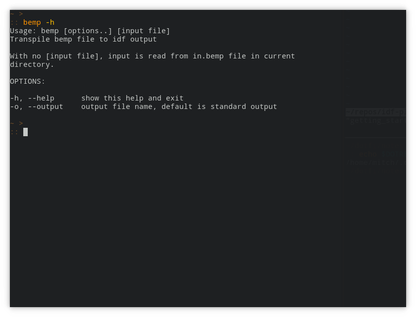

## Installation

### Download Program

The latest release of `bemp` is on GitHub, at
[https://github.com/mitchpaulus/idfplus/releases](https://github.com/mitchpaulus/idfplus/releases).
There you will see 3 main assets:

1. `bemp_linux-x64_x.x.x.zip`
2. `bemp_osx-x64_x.x.x.zip`
3. `bemp_win-x64_x.x.x.zip`

Download the zip file that matches your operating system.^[If you are
running the Windows Subsystem for Linux within Windows, I would
recommend the Linux version, and installing like a Linux program]

Extract that zip file to a location that you will want the program to
live. It doesn't really matter where you put it, but recommended places
would be:

- `C:\Program Files\bemp` on Windows
- `/usr/local/bin` or `~/.local/bin` on Linux

`bemp` is a console or command line application. It is meant to be run
from a shell environment, that could be anything like:

- `cmd.exe` or PowerShell on Windows
- Any terminal emulator, like Gnome Terminal, Alacritty, Konsole running
  a shell like `bash`, `zsh`, or `fish`.^[If none of this makes sense,
  take a look at [this
  link](https://www.unixsheikh.com/articles/the-terminal-the-console-and-the-shell-what-are-they.html)
  or other web searches for 'terminal vs. shell']


### Add Program Location to PATH Variable

Once the program files are installed in your preferred location, you
will want to add the folder to the `PATH` environment variable (if the
location you put it in isn't already there).


### Execute the Program

On Windows, the program is called `bemp.exe`. On Linux and OSX, it is
just `bemp` with no extension.

From the shell, you can test that things are working by running the
command with the help argument like:

```sh
bemp -h
```

on Windows:

```sh
bemp.exe -h
```

{ width=630 height=450 }
